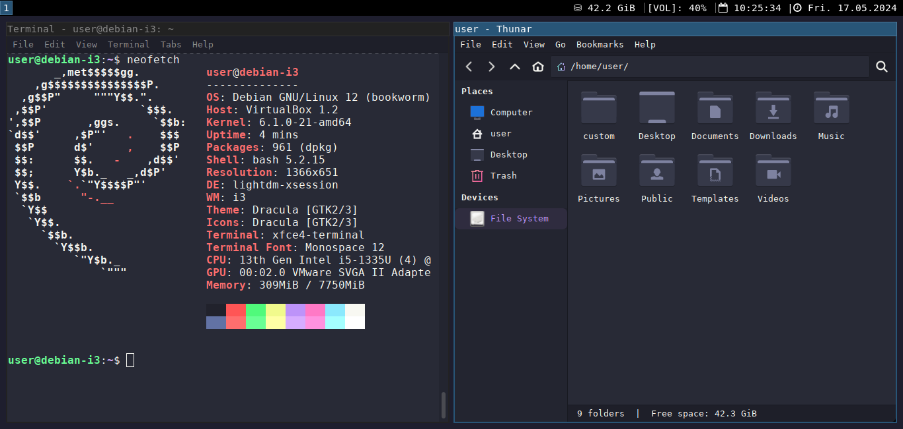
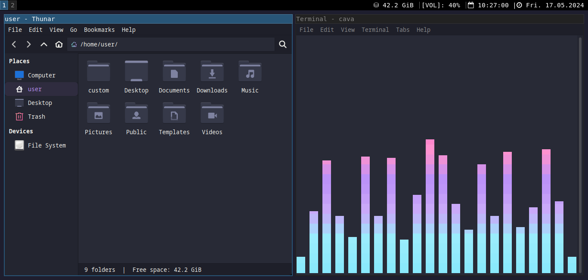

# i3-Tiling-Window-Manager-Setup
<br>
<div align="center">
  
</div>
<br><br>

## A Simple <a href="https://i3wm.org/">i3-wm</a> Setup For Debian or Kali Linux. <a href="https://draculatheme.com/">Dracula Theme</a>
<div align="center">
  <a href="https://draculatheme.com/">
    
  </a>
</div>
<br>

## Install:

Install 
<a href="https://www.debian.org/download">Debian</a> or 
<a href="https://www.kali.org/get-kali/#kali-platforms">Kali Linux</a>. Do not install a desktop environment.

Debian:

```console

add sbin to $PATH

add $USER to "sudo" group

update and upgrade

install git

git clone https://github.com/midnit3Z0mbi3/i3-Tiling-Window-Manager-Setup.git

```

Kali:

```console

update and upgrade

install git

git clone https://github.com/midnit3Z0mbi3/i3-Tiling-Window-Manager-Setup.git

```

Both:

```console

cd i3-Tiling-Window-Manager-Setup

chmod +x *.sh

sudo bash i3_install_setup.sh

reboot

bash i3_customized.sh

Restart i3 Inplace and open lxapperance

sudo nano /etc/lightdm/lightdm-gtk-greeter.conf

reboot

you can remove the git cloned repository and the "custom" directory if desired.

```

### Key Bindings:

Restart i3 Inplace mod+Shift+r

Open Application Launcher (dmenu) mod+d

Close/Kill a window mod+Shift+q

Web Browser mod+b

File Manager mod+Shift+Return  

Password Manager mod+p  

Lock screen mod+x 

These are the official <a href="https://i3wm.org/docs/refcard">i3wm Key Bindings</a> from their website.

<br><br>
<div align="center">
   
  <br>
   
</div>
<br><br>

**Login Screen/Lightdm:**

edit the /etc/lightdm/lightdm-gtk-greeter.conf file to change the background of the login screen.

background= hex color code or path to image

userbackground= false (to use a solid color for the background)

userbackground= true (to use an image for the background)

font= monospace (you can place any font you want here)

If you would like the login page the same color as the desktop wallpaper, use hex code #1e1e2e

other <a href="https://www.color-name.com/neutral-blue.color">neutral colors</a> 


```console
sudo nano /etc/lightdm/lightdm-gtk-greeter.conf

reboot

```

**Wallpaper:**

edit i3 config options at the bottom of the configuration file

image - feh

solid color (hex code) - xsetroot

other 
<a href="https://www.color-name.com/neutral-blue.color">neutral colors</a> 

wallpaper hd, 4k, 8k

https://pixlr.com

https://wall.alphacoders.com/

https://hdqwalls.com/

## Btop is installed. Btop is a terminal based resource monitor.

<br>
<div align="center">
  
</div>
<br>

