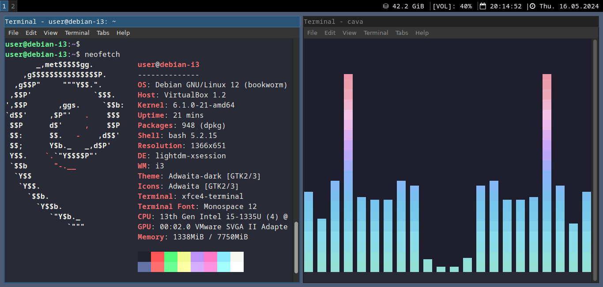
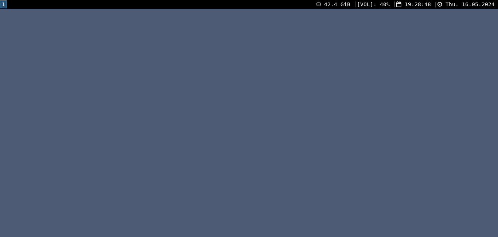
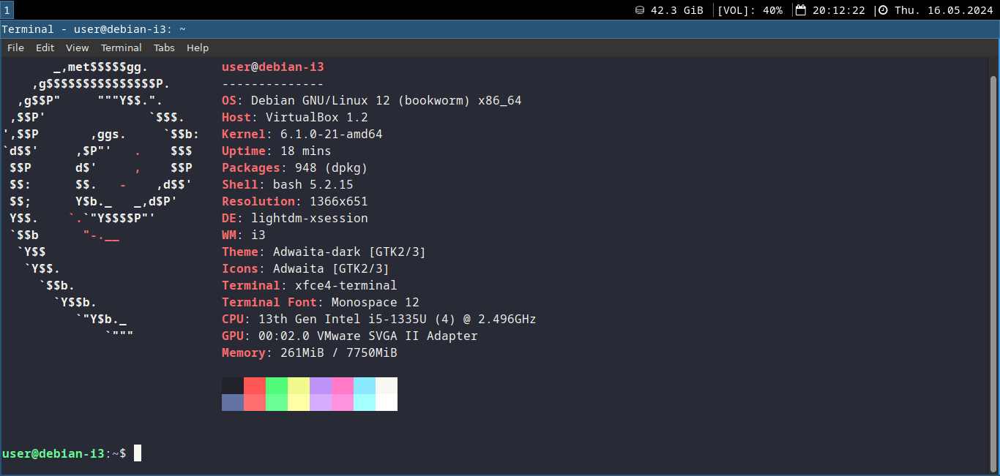

# i3-Tiling-Window-Manager-Setup 

This is a simple i3 setup. Smart gaps, standard terminal, i3status bar, i3lock screen, menu, and cava.

  

**Install:**

Install Debian or Kali Linux. Do not install a desktop environment.

update and upgrade

clone this repository and run the set up script

git clone https://github.com/midnit3Z0mbi3/i3-Tiling-Window-Manager-Setup.git

chmod +x i3_install_setup.sh

sudo bash i3_install_setup.sh

reboot

cd i3-window-manager-setup

chmod +x i3_customized.sh

bash i3_customized.sh

Reload the configuration file mod+Shift+r

reboot

  

**Login Screen/Lightdm:**

edit the /etc/lightdm/lightdm-gtk-greeter.conf file to change the background of the login screen.

background= hex color code or path to image

userbackground= false (to use a solid color for the background)

userbackground= true (to use an image for the background)

If you would like the login page the same color as the desktop wallpaper, use hex code #4D5C74 

other neutral colors https://www.color-name.com/neutral-blue.color

sudo nano /etc/lightdm/lightdm-gtk-greeter.conf

reboot

**Wallpaper:**

edit i3 config options at the bottom of the configuration file

image - feh

solid color (hex code) - xsetroot

other neutral colors https://www.color-name.com/neutral-blue.color

  

**You can customize the desktop even more...**

https://itsfoss.com/i3-customization/

https://www.reddit.com/r/unixporn/

**My favorites:**

https://draculatheme.com/

https://github.com/catppuccin

**Key Bindings:**

Web Browser mod+b

File Manager mod+Shift+Return  

Password Manager mod+p  

Lock screen mod+x 

